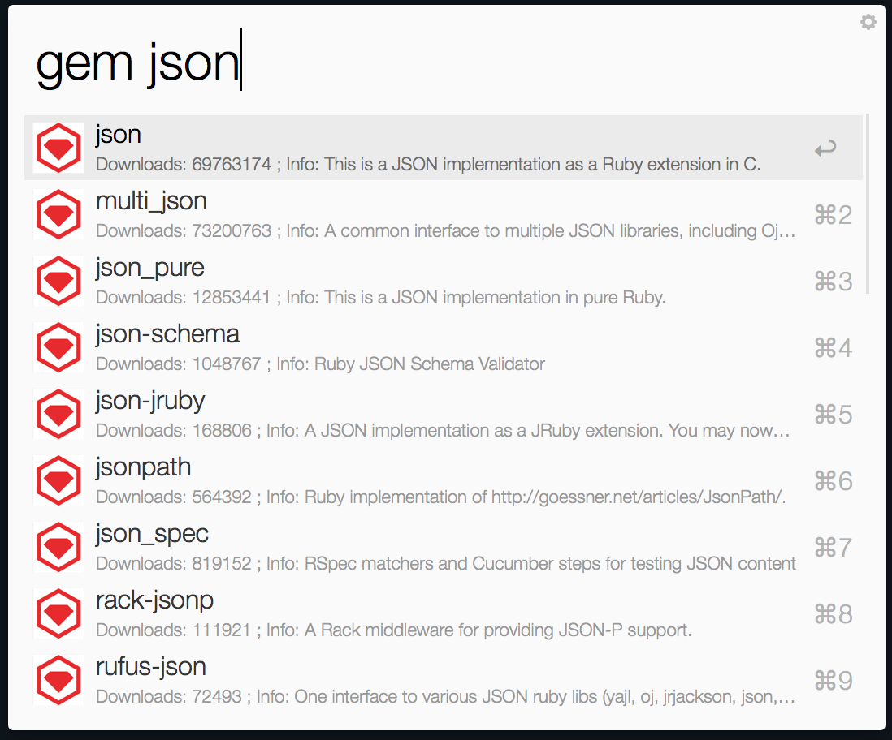
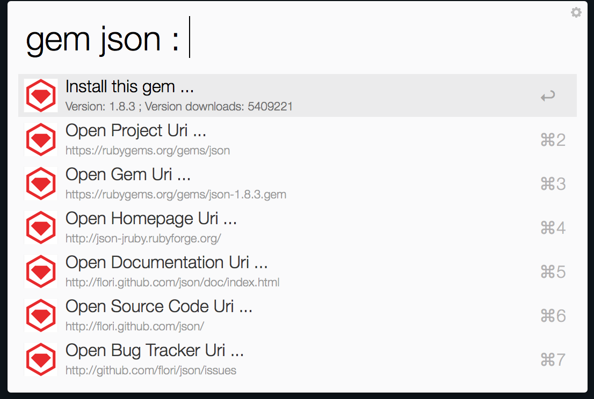

# ruby_gems_org_alfred_workflow

Search and install rubygems from rubygems.org .

Input the gem name to search gem .

Choose the gem you want and press Enter .

Choose install the gem or open the uri .

## Download

[RubyGems.alfredworkflow](https://github.com/echohn/ruby_gems_org_alfred_workflow/raw/master/RubyGems.alfredworkflow)
